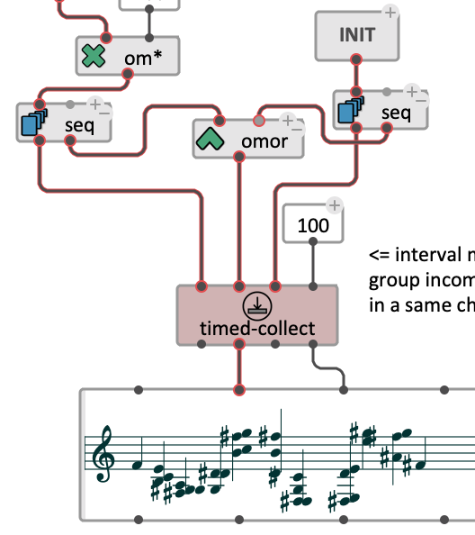

I am a computer music researcher and software engineer: this page is a hub for links and resources related to some present and past activity. 

I am currently working at <a href="http://www.ableton.com" target="_blank">Ableton</a>, as a software engineer on the company's flagship software, <a href="https://www.ableton.com/en/live/" target="_blank">Live</a>.
Before that — from 2003 to 2019 — I was at <a href="https://www.ircam.fr/recherche/" target="_blank">IRCAM</a> in the <a href="http://repmus.ircam.fr/" target="_blank">Music Representations team</a> of the <a href="https://www.stms-lab.fr/" target="_blank">STMS lab (Science and Technology of Music and Sound)</a>. My main focus area was computer-aided music composition and domain-specific (visual) programming: I was the developer and researcher in charge of the <a href="https://openmusic-project.github.io/" target="_blank">OpenMusic</a> project, and connected this environment to digital sound processing, spatialization, and real-time interaction systems (see <a href="projects#om">the projects page</a>). 

I obtained my PhD from the Université Pierre et Marie Curie in 2007, and my [_Habilitation_ degree (HDR)]((https://hal.archives-ouvertes.fr/tel-01525998/)) in 2017.
In 2016 I was at [CNMAT](http://www.cnmat.berkeley.edu/) / UC Berkeley with a Fulbright [research scholarship](http://www.cnmat.berkeley.edu/projects/jean-bresson-interactive-visual-programming-systems-music-composition). 
In 2018-2019 I was also part-time guest lecturer at the [Institut für Musikwissenschaft und Musikinformatik](http://www.hfm-karlsruhe.de/imwi/index.htm) of the Hochschule für Musik in Karlsruhe. 

-----

#### – Current projects

<table class="project">
<tr><th>OM#</th></tr>
<tr><td>

<b>OM#</b> is a computer assisted composition and visual programming environment derived from <a href="https://openmusic-project.github.io/" target="_blank">OpenMusic</a> (see <a href="projects#om">past projects</a>), featuring a fully redesigned visual programming framework, as well as advanced tools for interactive computer assisted composition and digital signal processing.

The environment was initially concieved as a new implementation of OpenMusic. Key features and developments were carried out during the <a href="http://repmus.ircam.fr/efficace/" target="_blank">EFFICACe</a> research project (2013-2017), while exploring interactive approaches in computer-assisted music composition processes: timeline-based interactive control of musical objects, dynamic scheduling architecture for musical rendering and computation, new interfaces for the temporal representation of compositional processes.
The "reactive" model, previously introduced as a prototype in OpenMusic, was also integrated as a native feature.

After successive code-names (om7-beta/o7/...) the project was named <b>OM#</b> (om-sharp) shortly before the v1.0 release in the end of 2019.

<b>&rarr; <a href="https://cac-t-u-s.github.io/om-sharp/">om-sharp project page</a> (incl. downloads, documentation, etc.)</b>
</td></tr></table>

 

<table class="project">
<tr><td>
<b>More: <a href="projects">&rarr; Other/past projects I've been working on...</a></b>
</td></tr></table>

-----
#### – Publications

- [List of publications](publi).
- _[The OM Composer's Book](http://repmus.ircam.fr/openmusic/ombook)_: A series of 3 books about OpenMusic and its use by composers.
- [Habilitation thesis](https://hal.archives-ouvertes.fr/tel-01525998/) [In French]: _Composition assistée par ordinateur : techniques et outils de programmation visuelle pour la création musicale_.

<!-- _Computer-assisted composition: visual programming techniques and tools for musical creation_ -->

<!--
##### Mémoire d'Habilitation à Diriger des Recherches / _Habilitation Thesis_  (2017):       
Composition assistée par ordinateur : techniques et outils de programmation visuelle pour la création musicale      
_Computer-assisted composition: visual programming techniques and tools for musical creation_.     
**[Thesis [in French]](https://hal.archives-ouvertes.fr/tel-01525998/)** \| [Support materials](http://repmus.ircam.fr/bresson/hdr).
-->

-----
#### – Research / PhD supervision

- Martin Fouilleul, PhD IRCAM / STMS lab (Sorbonne Université, Paris): _Architecture and language for distributed temporal flow management, and applications to multimedia creation_ (co-direction with [J.-L. Giavitto](http://repmus.ircam.fr/giavitto)).

<!--
- Antoine Caillon,  PhD IRCAM / STMS lab (Sorbonne Université, Paris): _Hierarchical temporal learning​ for multi-instrument and orchestral audio synthesis_ (co-direction with P. Esling).
-->

##### Previously (PhDs):

- Marlon Schumacher, McGill University, Montreal, CA: [A Framework for Computer-Aided Composition of Space, Gesture, and Sound](https://hal.archives-ouvertes.fr/tel-01491794/) (co-supervision / dir.: M. Wanderley, S. Ferguson, 2016).
- Charles de Paiva Santana, Université Pierre et Marie Curie, Paris / University of Campinas, Brasil. International Doctoral Program of the Research Institute for Development (IRD): [The Musical Score as an Instance: Essays in Computer-Assisted Analysis](http://repositorio.unicamp.br/jspui/handle/REPOSIP/330294) (supervision / dir.: M. Andreatta, J. Manzolli, 2016).
- Dimitri Bouche, IRCAM / STMS lab (Sorbonne Université, Paris): [Interactive compositional processes : a framework for programming and rendering musical structures](https://tel.archives-ouvertes.fr/tel-01524393/) (2016).

<!-- Here is a [list of former students and researchers I have supervised](supervision).-->

-----

#### – Community 

I am currently in the steering committees of:

- [TENOR](https://www.tenor-conference.org) Internation Conference on Technologies for Music Notation and Representation (_General Chair_).
- [FARM](https://functional-art.org): ACM SIGPLAN International Workshop on Functional Art, Music, Modelling and Design.
- [AFIM](http://afim-asso.org) : French Computer Music Association.

 

As for 2020-2021, I am in the scientific committee of the following conferences:     

- Sound and Music Computing: [SMC'20](https://smc2020torino.it/uk/) / [SMC'21](https://smc2021conference.org/), Torino, Italy \| Online event (_Senior Scientific Committe_).
- [TENOR'20 / TENOR'21](https://tenor2021.hfmt-hamburg.de/), Hamburg, Germany.
- [ACM SPLASH 2020 \| Onward! Essays](https://2020.splashcon.org/track/splash-2020-Onward-Essays), Chicago, USA \| Online event.
- [Journées d'Informatique Musicale / JIM 2020](https://jim2020.sciencesconf.org/), Strasbourg, France \| Online event.

 
In the past, I also coordinated a number of events and research groups or seminars, such as:    

- [MaMuX: Mathematics, Music and relations to other disciplines](http://repmus.ircam.fr/mamux/) (2011-2014, IRCAM, Paris — 8 annual half-day sessions, 80+ speakers).
- [MusICAL network Seminar Series](http://repmus.ircam.fr/musical/) on Interaction, Calculus, Algorithmics and Languages applied to Music \[FR\] (2015-2018).
- [New spaces of music notation](http://notation.afim-asso.org/) work group of the AFIM (French computer music association) (2013-2015)
- [MCM]() International conference on Mathematics and Computation in Music (2011, IRCAM, Paris).
- Research workshops: [Interactivity in Music Composition and Performance](http://repmus.ircam.fr/efficace/events/workshop-cirmmt) (CIRMMT/McGill University, Montreal, 2015), [Human-Computer Interactions in Music](http://repmus.ircam.fr/efficace/events/workshop-berkeley) (CNMAT/UC Berleley, 2016), [Music Composition and Creative Interaction with Machine Learning](http://repmus.ircam.fr/paco/workshop-smc), (Sound and Music Computing, Cyprus University, 2018),...
- etc.

