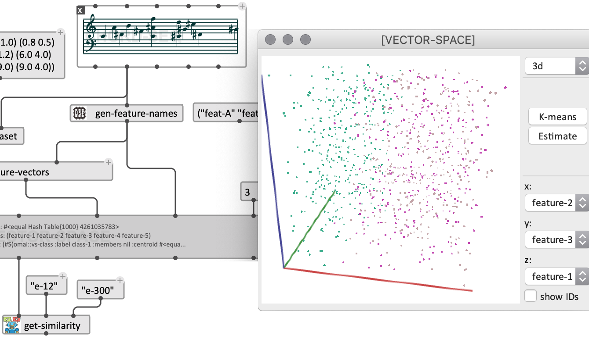

# Projects
Some other / past projects...

<a name="om">
<table class="project">
<tr><th>OpenMusic (2003-2019)</th></tr>
<tr><td>

OpenMusic was the main project I worked on when I was at IRCAM. This visual programming language based on Lisp was initially developed by <a href="https://www.stms-lab.fr/person/carlos-agon-amado/" target="_blank">Carlos Agon</a> and <a href="https://www.stms-lab.fr/person/gerard-assayag/" target="_blank">Gérard Assayag</a> while I was still in the playgrounds. I created and released the first multi-platform version of the environment (<a href="https://hal.archives-ouvertes.fr/hal-01161332" target="_blank">OM5</a> for Mac/Windows) in 2005. OM6 was then released just a few years later, in 2008. It is still the version that is used today ! In 2012 I started to collaborate with <a href="https://www.avinjar.no/" target="_">Anders Vinjar</a> with the support of the Norwegian centers BEK and Notam, on a <a href="https://hal.archives-ouvertes.fr/hal-01075235" target="_">Linux version</a> that is now also available.

OpenMusic has grown to be a reference environment for computer-assisted music composition. It is today used and taught by <a href="http://repmus.ircam.fr/openmusic/ombook" target="_">many composers</a> in many institutions worldwide.     

While continuing to maintain and support OpenMusic, in recent years I started a new implementation of the environment as a context and outcome of research projects, and progressively focused on what has now become <a href="https://cac-t-u-s.github.io/om-sharp/" target="_blank">OM#</a>. 

<h4>Links:</h4>
<ul>
	<li>
	<a href="http://openmusic-project.github.io/" target="_blank">OpenMusic main site</a> (including an extended set of add-on libraries). 
	</li>
<li>
	<a href="https://forum.ircam.fr/collections/detail/om-librairies/" target="_blank">IRCAM Forum Collection</a> (with some other external libraries)
</li>
</ul>

</td></tr></table>

<table class="project">
<tr><th> Cosmologies of the Concert Grand Piano (2019-2020)</th></tr>
<tr><td>

I was the Technical Project coordinator of <a href="https://aaroneinbond.wordpress.com/" target="_blank">Aaron Einbond</a>'s Vertigo S+T+ARTS residency <i>Cosmologies of the Concert Grand Piano</i>.

In this project, we brought together the results of recent research projects on granular/concatenative synthesis, spatialization (and a little bit of machine learning), in order to implement a model of spatial synthesis based of 3D-radiation patterns of acoustic instruments, running on <a href="https://cycling74.com/">Max</a> and <a href="https://cac-t-u-s.github.io/om-sharp/">OM#</a>.   

<i>Cosmologies</i> was premiered at the <i>Ircam Live</i> concert at au Centre Pompidou, Paris on the 5/03/2020.

<b>&rarr; <a href="https://vertigo.starts.eu/calls/starts-residencies-call-3/residencies/cosmologies-of-the-concert-grand-piano/detail/" target="_blank">S+T+ARTS project page</a></b> 

<b>&rarr; <a href="https://www.vertigo-starts-residencies.com/single-post/2020/04/15/Cosmologies-at-Centre-Pompidou" target="_blank">Aaron's Blog post</a></b> 

<b>&rarr; <a href="https://youtu.be/RvTTgEdA0J0" target="_blank">Aaron's Interview</a></b> 

<b>&rarr; <a href="https://medias.ircam.fr/embed/media/xafad3c" target="_blank">Aaron's Ircam talk</a></b> 

</td></tr></table>

<table class="project">
<tr><th> PACO: Artificial Intelligence and Computer-Assisted Composition (2018-2019) </th></tr>
<tr><td>

PACO is a start-up funding from the CNRS "PEPS" program for an exploratory project about artificial intelligence (just like everybody else!), machine learning and computer-assisted composition.

With this project our objective was to explore the possibility for composers to use AI and machine learning techniques within the framework of creative processes (and not as a substitution or complement to creativity), for the generation or transformation of musical data, or the resolution of musical problems dealing with abstract characteristics of musical structures, which are sometimes difficult to quantify and treat explicitly by classical programming techniques.

Composers <a href="https://www.avinjar.no/" target="_">Anders Vinjar</a>, <a href="https://www.alirezafarhang.com/post/traces-of-expressivity-data-stream" target="_">Alireza Farhang</a>, as well as Paul Best (software engeneering intern, co-supervised with Diemo Schwarz) were my main collaborators on this project. 
Anders Vinjar is currently following-up on it, in the context of a musical research residency at IRCAM (2019-2020).

<b>&rarr; <a href="http://repmus.ircam.fr/paco/home-en" target="_blank">PACO project page</a></b> 

</td></tr></table>

<table class="project">
<tr><th> Symbolist (2018) </th></tr>
<tr><td>

<a href="https://github.com/ramagottfried/symbolist" target="_blank">Symbolist</a> is a collaboration with composer <a href="http://www.ramagottfried.com/" target="_blank">Rama Gottfried</a>, started in 2018 during his musical research residency at IRCAM.

Our objective was to create a graphic notation environment for music and multimedia, enabling graphical editing, programming, and streaming of multi-rate/multidimensional control data encoded as OSC structures.

Vincent Iampietro (Master's student) also worked on the develoment of the current prototype.
Rama is now continuing this project at the Hochschule Für Musik in Hamburg.

</td></tr></table>

<table class="project">
<tr><th> o.OM: Experiments with CNMAT's odot library (2016) </th></tr>
<tr><td>

I was at UC Berkeley in 2016 in a <a href="http://www.cnmat.berkeley.edu/projects/jean-bresson-interactive-visual-programming-systems-music-composition" target="_blank">Fulbright Research scholarship</a>, where I had the chance to collaborate with <a href="http://john-maccallum.com/" target="_blank">John MacCallum</a>, <a href="https://adrianfreed.com/" target="_blank">Andrian Freed</a> and other <a href="http://www.cnmat.berkeley.edu/" target="_blank">CNMAT</a> fellows on the development of applications of the <i>odot</i> library in OM.

<b>&rarr; <a href="https://hal.archives-ouvertes.fr/hal-01353794" target="_blank">FARM'16 Paper</a></b> 

</td></tr></table>

<table class="project">
<tr><th>DYCI2 : Creative Dynamics of Improvised Interaction (2015-2018)</th></tr>
<tr><td>

<i>DYCI2 explores the Creative Dynamics of Improvised Interactions between human and artificial agents, featuring an Informed Artificial Listening scheme, a Musical Structure Discovery and Learning scheme, and a generalized Interaction / Knowledge / Decision dynamics scheme.</i>

<b>&rarr; <a href="http://repmus.ircam.fr/dyci2/" target="_blank">DYCI2 poject pages</a></b>

In line with a tradition of research and environments developed in the Music Representation team at Ircam, the <a href="http://repmus.ircam.fr/dyci2/" target="_blank">DYCI2 library</a> created by <a href="https://jeromenika.com/" target="_blank">Jérôme Nika</a> allows musicians to interact with improvising agents, adding up to its predecessors such as <a href="http://repmus.ircam.fr/omax/" target="_blank">OMax</a> the notion of scenario guidance, previously developed in the <a href="http://repmus.ircam.fr/nika/improtek" target="_blank">Improtek</a> project. 

Together we integrated this in the OpenMusic/OM# environments, allowing for hybrid offline/ineractive processing and generation of 	musical material. 

<b>&rarr; <a href="https://github.com/DYCI2/om-dyci2/wiki/[en]" target="_blank">OM-DYCI2</a></b>

</td></tr></table>

<table class="project">
<tr><th> EFFICACe: Interactivity in Computer-Assisted Composition Processes (2013-2017) </th></tr>
<tr><td>

EFFICACe was an exploratory research project that I coordinated at Ircam, funded by the French <a href="https://anr.fr/Project-ANR-13-JS02-0004" target="_blank"> National research Agency</a>. 

The project explored the relations between computation, time and interactions in computer-aided music composition, using OpenMusic and other technologies developed at IRCAM and at <a href="http://www.cnmat.berkeley.edu/" target="_blank">CNMAT</a>. Considering computer-aided composition out of its traditional "offline" paradigm, we tried to integrate compositional processes in structured interactions with their context: the interactions taking place during executions or performances, or at the early compositional stages (in the processes that lead to the creation of musical material). In this perspective we have studied reactive approaches for computer-aided composition, the notion of dynamic time structures in computation and music, rhythmic and symbolic time structures, and new modalities for the interactive control, visualisation and execution of sound synthesis and spatialization processes. 

I have worked on this project together with <a href="" target="_blank">Dimitri Bouche</a> (PhD student), <a href="http://recherche.enac.fr/~jeremie.garcia/" target="_blank">Jérémie Garcia</a> (post-doctoral researcher), <a href="https://www.stms-lab.fr/person/thibaut-carpentier/" target="_blank">Thibaut Carpentier</a> (CNRS/Ircam), <a href="http://imtr.ircam.fr/imtr/Diemo_Schwarz" target="_blank">Diemo Schwarz</a> (Ircam) and <a href="https://jacquema.gitlabpages.inria.fr/" target="_blank">Florent Jacquemard</a> (Inria/Ircam). 

EFFICACe research also led to most of the novel features of the <a href="https://cac-t-u-s.github.io/om-sharp/" target="_blank">OM#</a> environment.

<b>&rarr; <a href="http://repmus.ircam.fr/efficace/" target="_blank">Project pages</a></b>
</td></tr></table>

<table class="project">
<tr><th> SampleOrchestrator: OM-Orchidée (2010-2012) </th></tr>
<tr><td>

During the SampleOrchestrator project (ANR-06-RIAM-0027) I created (with <a href="https://www.gregoirecarpentier.net/" target="_blank">Grégoire Carpentier</a>) a client for the Orchidée orchestration software in OpenMusic. Orchidée was a orchestral constraint solver implemented as a Matlab server commubicating through OSC. The OpenMusic client (<a href="https://github.com/openmusic-project/OM-Orchidee" target="_blank">OM-Orchidée</a>) consisted in a set of objects for the specification of orchestral constraints and the generation of a "sound target" (a mix of symbolic and audio descriptors), and the decoding dans musical representation of orchestral solutions proposed by Orchidée.    

<b>&rarr; <a href="https://hal.archives-ouvertes.fr/hal-00683471" target="_blank">CMJ Paper</a></b> 

</td></tr></table>

<table class="project">
<tr><th> Sound processing / synthesis in OpenMusic</th></tr>

<tr><td>

The work and research carried out in my PhD thesis (2004-2007) focused on the idea of integrating sound processing and stnthesis techniques in compositional processes and the OpenMusic environment.

I have created a number of libraries connecting with IRCAM sound processing tools, such as <a href="https://github.com/openmusic-project/OM-SuperVP" target="_blank">OM-SuperVP</a>, <a href="https://github.com/openmusic-project/OM-pm2" target="_blank">OM-pm2</a>, or <a href="https://github.com/openmusic-project/OM-Chant" target="_blank">OM-Chant</a> (see project below).

<a href="https://github.com/openmusic-project/OMChroma" target="_blank">OMChroma</a> is another project and long-lasting collaboration with composer <a href="http://brahms.ircam.fr/marco-stroppa" target="_blank">Marco Stroppa</a>, providing high-level tools and structures to control sound synthesis via <a href="https://csound.com/" target="_blank">Csound</a>.

</td></tr>

</table>

<table class="project">
<tr><th> OM-Chant (2010-2012) </th></tr>
<tr><td>

 <a href="https://github.com/openmusic-project/OM-Chant" target="_blank">OM-Chant</a> is a library for the control of Ircam's Chant synthesizer in OpenMusic. 
Developed in the early 80s based on formant-wave functions synthesis (FOF), Chant remains even today a quite unique tool for the synthesis of "voiced" sounds (sung vowels) and its <i>continuous</i> control.

Marco Stroppa's opera <a href="https://www.opera-comique.com/fr/saisons/saison-2011-2012/mai/re-orso" target="_blank">Re Orso</a> (2012) was an important moment in this project development and the first important application of OM-Chant in such a wide production.

<b>&rarr; <a href="https://github.com/openmusic-project/OM-Chant/wiki" target="_blank">OM-Chant wiki</a></b> 

</td></tr></table>

<table class="project">
<tr><th> Spatialization Control (2008-2019) </th></tr>

<tr><td>

The next step after sound synthesis was to integrate sound spatialization in compositional processes.

I created <a href="https://github.com/openmusic-project/OM-Spat" target="_blank">OM-Spat 2</a>: a library for the generation of sound spatialization data and 2D/3D trajectories, connected to an offline renderer made with the Ircam Spatialisateur. 
OM-Spat also used <a href="http://sdif.sourceforge.net/" target="_blank">SDIF</a> files for encoding and storage of trajectories. 
<a href="https://github.com/j-bresson/Spat-SDIF-Player" target="_blank">Spat-SDIF-Player</a> is another tool created in Max for real-time OSC streaming of SDIF-encoded trajectories.

In the same period I collaborated with <a href="http://www.music.mcgill.ca/marlonschumacher/" target="_blank">Marlon Schumacher</a> to the development of <a href="https://www-archive.idmil.org/projects/software/omprisma" target="_blank">OMPrisma</a>. 
OMPrisma extends <a href="https://github.com/openmusic-project/OMChroma" target="_blank">OMChroma</a>'s paradigm and <a href="https://csound.com/" target="_blank">Csound</a>-based techiques for the high-level of sound synthesis, allowing to merge Csoudn audio synthesis, processing and spatialization instruments in a comprehensive "spatial sound synthesis" framework (see for instance <a href="https://hal.archives-ouvertes.fr/hal-00683469" target="_blank">this paper</a>).

More recently, <a href="https://cac-t-u-s.github.io/om-sharp/" target="_blank">OM#</a> developements came along with a powerful <a href="https://github.com/cac-t-u-s/spat" target="_blank">new integration of Spat</a>, embedding both audio processing units and GUI controllers.  

</td></tr></table>

<table class="project">
<tr><th> Musique Lab 2 (2004-2010) </th></tr>
<tr><td>

Musique Lab 2 was a commission to Ircam by the French Ministry of Education (and my first real work contract at Ircam!). 
The idea was to create tools for music teachers to use computer-assisted compsoition technology to run music classes, allowing them to interactively demonstrate and workshop musical concepts and compositional processes from the repertoires ranging from early to contemporary music.

More concretely, it consisted in a single-window application developed on top of OpenMusic, including most underlying features and inbuilt musical knowledhe (+ some additional features such as the notion of tonality!), whithout the visual programming aspect.

The application was released for Mac and Windows (it is at the origin of the first Windows port of OpenMusic, which led to the release of OM5 in 2005) and distributed to music teachers through the Ircam Forum and the Educ'Net networks. Unfortunately the project was not supported much longer after the initial releases.

</td></tr></table>

<table class="project">
<tr><th> SDIF-Edit (2003-2004) </th></tr>
<tr><td>

SDIF-Edit was my first, student internship project developed when I started at IRCAM in 2003.
It is a 3D visualizer and editor developed in OpenGL, allowing to view the contents of SDIF files (<a href="http://sdif.sourceforge.net/" target="_blank">Sound Description Interchange Format</a>, a file format used by music applications to store dan exchange sounds analysis data, synthesis parameters, etc.)

An underlying idea was to embed sound description data in compositional processes via an integration in OpenMusic. 
This idea was brought a few steps further years later in 2017 in the context of <a href="http://www.savannahagger.com/" target="_blank">Savannah Agger</a>'s <i>Landschaften</i> <a href="http://repmus.ircam.fr/efficace/wp/agger" target="_blank">project</a>, and in the framework of <a href="https://cac-t-u-s.github.io/om-sharp/pages/3D-viewer" target="_blank">OM# developments</a>.

<b>&rarr; <a href="https://github.com/j-bresson/SDIF-Edit" target="_blank">SDIF-Edit on GitHub</a></b>
</td></tr></table>

<!--
<table class="project">
<tr><th>  </th></tr>
<tr><td>
	
</td></tr></table>
-->